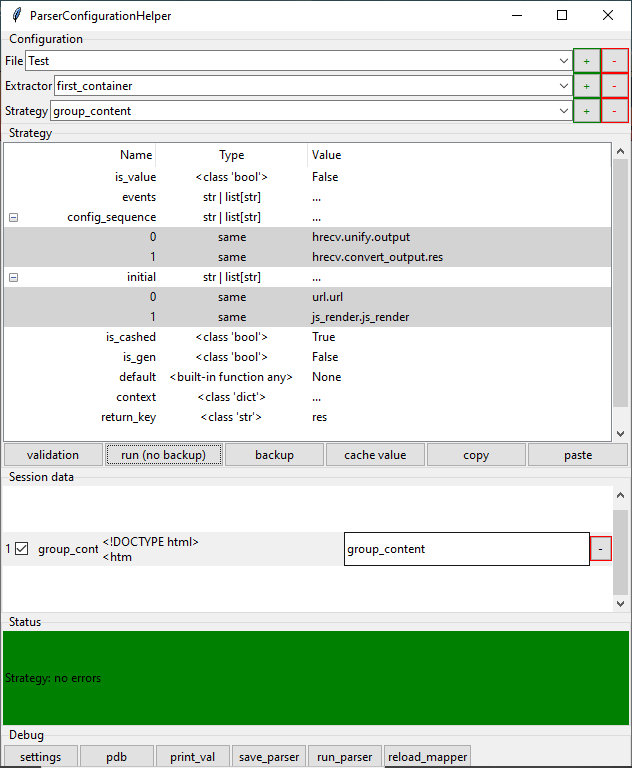

# Strategy dynamic container app with additional GUI Editor

This app was build from right to left = from features required in GUI to work to their code representation in module.
GUI in this case proxies classes from main module.
Main idea is to use config to reperesent strategy of data extracion or implement represents pattern *strategy*.. 
Current view require inheritance from class (`ConfigDependantParser`) that connect extractor's fields with each other (make dynamic class iterable for example).

## Aim (convert json repr to obj attr):
```python
"first_container": {
	"url": {
		"is_value": true,
		"default": "www.google.com"
	}
}
-> 
some_obj.url 
>>> "www.google.com"
```
## Dynamic container consist from next stages:
- parser (_dynamic_)
  - extractor (_dynamic_, _substitution_)
    - strategy (`CachedStrategy` proxy `Strategy`)

Parser - only contains extractors
Extractors - on attibute call extract `Strategy` from `CachedStrategy`, than run it, meanwhile get additional required fields from extractor (his neighbors) (that also run).
Strategy - represent type of value. How to get it through all necessery relations.

```python
@dataclass
class Strategy(TreeviewInsertable, EmptyContainerCreatable):
    is_value: bool = False
    events: str | list[str] = field(default_factory=list) #not ! list[list[str]]
    config_sequence: str | list[str] = field(default_factory=list)
    initial: str | list[str] = field(default_factory=list)
    is_cashed: bool = False
    is_gen: bool = False
    default: any = None
    context: dict = field(default_factory=dict)
    return_key: str = 'res'
    description: str = None
```


### Some additional bechaviour was developed:
- autoconfig (all classes whith inheritance from `AutoConfig__mark` and have `ConfigField` fields participate in startup programm configuration params setting)
- auto mapping to required parser by computing `is_acceptable` condition

### Current underwhelming:
- Monolith struct. High integration. Some parts can be separated into reusable modules
- Helper app traceback representation.
- Addiction to functional inherited class to implement iteration. (solve with event bechaviour = change state of generatable value to get next from future call)
- Documentation
- Helper app tutorial (some features relate to use shortcuts and didn't have visual representation as buttons)
  - in `Strategy` LabelFrame: 
    - `<Shift +>` (while selected expandable) - add to the end
    - `<Shift Del>` (while selected item of expandable) - del selected item
    - `<Shift Up\Down>` (..item of exp..) - move up or down
    - `<DoubleClick>` (on Name/Value field) - edit value (False, True, None recognizable)

## How to run:
- parser `<workin-dir> pytnon.exe -m src --url https://docs.python.org/3/reference/index.html`
- helper `<workin-dir> pytnon.exe -m src/helper v2`

# Helper app 